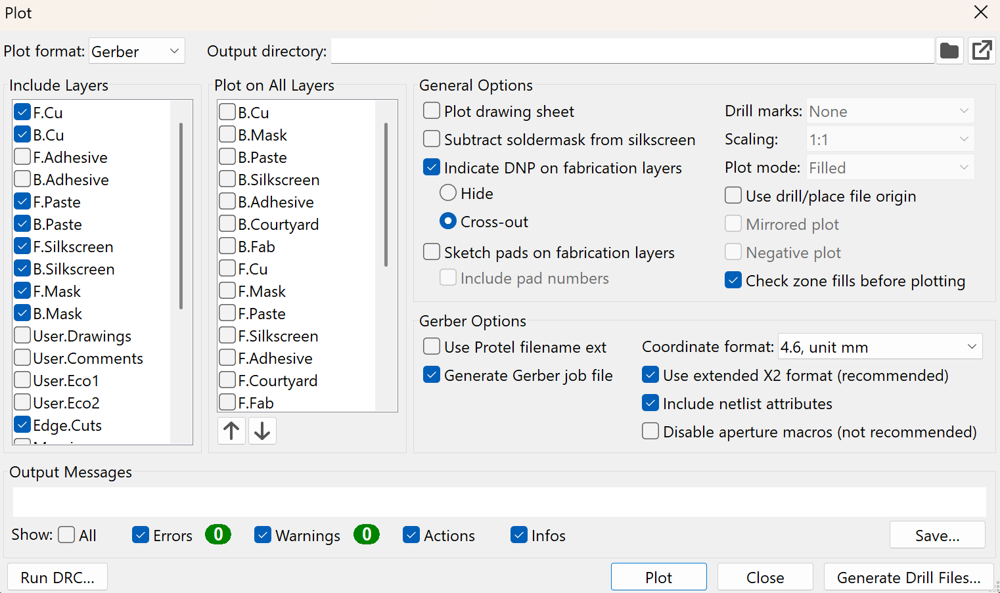

# **1 Introduction**

Welcome to the electrical side of the world here at Georgia Tech's
Marine Robotics Group! We're super excited for you to be a part of this
club and can't wait to see what you'll help us build. Whether you\'re
here to improve our power systems or design a new motor controller, this
tutorial will guide you through the magical (and sometimes chaotic)
world of PCB design.

## 1.1 Why PCBs?

For the early design process, breadboards and jumper wires are great,
but as time goes on, they start to fall apart, literally and
figuratively. In our vehicles, where things move, shake, and can draw
large amounts of power, loose connections and tangled wires can lead to
frustrating bugs, inconsistent behavior, or even hardware failure.

That's where the advantage of custom-designed PCBs comes in.

PCBs can have many layers. The ones we'll be focusing on are the
silkscreen and the copper layers. The silkscreen layers (back and front)
allow you to draw lines or write words on your PCB. The copper layers
are where all of the electrical connections actually happen (think the
jumper wires). You can have a varying number of copper layers for a PCB,
which usually depends on the complexity of your PCB. We mostly design
2-layer boards (back and front copper layer).

## 1.2 Scope and Goals

By following this tutorial, you will learn step-by-step how to design
PCBs that are used in every single MRG project. This tutorial will walk
you through downloading KiCad, defining the design parameters, designing
the schematic, laying out the PCB, verifying your design, prepping the
design for order or for fabrication, and finally testing it.

This guide won't teach you everything there is to know about KiCad, but
it will give you a really good place to start actually working on PCBs
for MRG (which is the best way to learn!).

# **2 Getting Started**

Now that we've laid out the basic idea of PCBs and defining the purpose
of this tutorial, we can actually start.

## 2.1 Downloading KiCad

Download KiCad 9.0 (or whatever is the most updated version at the
time). KiCad, a free software, is one of many electrical design software
and it is what the standard will be for the club. This guide uses KiCad
9.0.

## 2.2 Starting a Project, Exploring the KiCad Interface, and Basic Controls

Once you've downloaded KiCad, open up the app. This is what you should
see.

**Figure 2.2.1: KiCad Home Page**

Here on the home page, there are many different subpages that you'll be
using throughout the design process (mostly Schematic Editor, Symbol
Editor, PCB Editor, and Footprint Editor). We'll talk about most of
these later on in the tutorial.

To start, click File\>\>New Project..., which will open up your personal
File Explorer. Give your project a meaningful name (maybe
"tutorial_project") and place this project wherever you'd like in your
own computer, just make sure you remember where it is.

Now that we've created our project, we'll take a step back and go over
some basic KiCad controls:

- KiCad doesn't automatically save your progress, so remember to
  "Ctrl+S" often to save your work.

- Clicking an item and then hitting "M" will allow you to move that
  item, following your cursor. To place it back down, left-click your
  mouse.

- Clicking an item and then hitting "R" will allow you to rotate that
  item.

- Double clicking an item allows you to open up the details of that
  item. Single clicking just selects the item.

- Escape is a key button, because it allows you to exit modes, cancel,
  or back out of what you are doing. So for example, when you're done
  placing items, you'll stay in the "place items" mode, so you'll need
  to hit "Esc" in order to exit that mode.

- Delete is also a key button, which allows you to delete items when you
  need to.

- Common keyboard shortcuts work in KiCad. For example, you can "Ctrl+C"
  and "Ctrl+V" items, you can select all items with "Ctrl+A," and even
  undo things with "Ctrl+Z"

## 2.3 Defining the Specific Project Goals

So here is the issue (true story). Robosub is realizing that the buck
converters that they purchased online for cheap have a few problems.
Buck converters are a component in power engineering that are used to
take a high voltage and "buck" it down to a lower one. This way, we can
take the voltage from our battery, 16V, and bring it down to 12V, which
we can use to power a key sensor for the vehicle.\
\
Upon startup, they are noticing that there is a big spike in the
voltage. This means that the sensor, which is only rated to up to 12.5V,
is momentarily receiving a way bigger voltage. Over time, this degrades
the sensor, and eventually it breaks.\
\
What's the solution? We are tasked to design our own buck converter
"protection" circuit, using a more expensive (and therefore higher
quality) buck converter that we have in the lab: the I1C2W010A120V. If
we take a look at the
[[datasheet]{.underline}](https://product.tdk.com/system/files/dam/doc/product/power/switching-power/dc-dc-converter/catalog/i1c_e.pdf),
we can see that this will give us the output voltage that we need. *We
encourage you to read the datasheet over and get used to how these look,
because reading/understanding datasheets is a key part of designing
PCBs*. Additionally, if we scroll down, we can see that the datasheet
gives us a "Typical Application Circuit" that shows us what we'll need
to add to the buck converter to make it safe.

**Figure 2.3.1: Typical Application Circuit for the Buck Converter**

Next, we want to add some additional components that will ensure that if
a voltage spike were to ever happen, our circuit would "clamp" the
voltage down to a safe level for the sensor. After talking to some of
the other electrical engineers in the club, we decide that the best way
to do this is to use a [[TVS diode protection
circuit]{.underline}](https://components101.com/articles/how-to-use-tvs-diodes-for-transient-voltage-suppression),
like shown below.

**Figure 2.3.2: TVS Diode Protection Circuit Example**

The last thing that we need to decide is connectors. Talking to Robosub,
we decide that [[XT60
Connectors]{.underline}](https://cdn11.bigcommerce.com/s-f6vfspkkjf/images/stencil/original/products/2617/9979/3803-1516-0505__27411__97450.1701976087.jpg?c=1)
are going to be the best for input and output of our board, considering
that the battery output is already XT60.

So after talking to the "customer" and doing our own research, we can
come up with our own block diagram of the board, which is shown below in
Figure 3.

**Figure 2.3.3: Block Diagram for Buck Converter Protection PCB**

And just like that, we're ready to start actually designing our PCB!

# **3 Schematic Design**

In KiCad, designing the schematic is where you create the logical
representation of your circuit. By doing this part of the design, you
are making a blueprint for the PCB, describing how each of the
components that you place down are connected to each other. This part of
the process doesn\'t worry about the physical layout or placement of
components on a board, just how they are electrically connected.

Now open up the schematic editor or click the projectname.kicad_sch
file. It should look something like this:

**Figure 3.1.1: Blank KiCad Schematic Editor Interface**

There's a lot of stuff on this page, we'll walk through the most
important things -

*On the right side of the page:*

: This is "Place Symbols," which allows us
to put down our desired components. The keyboard shortcut for this is
"A."

}: This is "Draw Wires," which allows us to
connect our components with theoretical wires. The keyboard shortcut for
this is "W."

: This is "Place Net Labels," which is
another way for us to connect components. When you label 2 wires with
the same name, they become electrically connected. This could be helpful
for situations where you need to connect more than 2 things, which can
create a "net." The keyboard shortcut for this is "L."

: This is the "Place No Connect Flags,"
which is a way to designate that a specific pin will remain unconnected

*On the top of page:*

: This opens the "Symbol Editor," which
allows us to edit/create symbols and symbol libraries. Symbols represent
the components for the schematic, detailing the input/output pins for
the components.

: This opens the "Footprint Editor," which
allows us to edit/create footprints and footprint libraries. Footprints
physically represent the components for the layout process (we will
discuss this later), detailing where the input/output pins physically
are, relative to the component itself.

: This opens the "PCB Editor," which
allows us to design the layout of the PCB. We will use this later, once
we complete the schematic design.

## 3.1 Adding Components

Now that we have a basic understanding of the schematic editor
interface, let's start placing components and connecting our parts.
Click the "Place Symbols" button or press "A." Here is what you should
see:

**Figure 3.1.1: Choose Symbol Page**

This is where you will search up and place the components that you need
for your PCB. For our board, the list of what we'll need is below.
Search all of these up and place them down onto the drawing sheet.

*Note: We use the "US" version of certain components. If you'd like you
can use the standard ones, it doesn't make a difference.*

- 1 TVS Diode, **D_TVS**

- 2 Capacitors, **C**

- 2 Polarized Capacitors, **C_Polarized_US**

- 1 Resistor, **R_US**

- 2 Connectors, **Conn_01x02**

- The I1C2W010A120V Buck Converter**\*\*\*\*\***

*Do it yourself!: 1) Think about why we chose the 01x02 version of the
connector (hint: remember what connector we are using). 2) Why don't we
need the Rdn and Rup resistors specified in the "Typical Applications"
diagram? (hint: read the datasheet and understand what these
resistors/the pins that they are connected to do)*

**\*\*\*\***Once you start placing them down, you'll realize that
there's an issue. The buck converter that we want to use doesn't exist
in KiCad's native symbol libraries! This means that we are going to have
to make our own symbol (next section).

Before we do that though, let's take a deeper look at one of our placed
components (a capacitor for this example) and examine what everything
means.

**Figure 3.1.2: A Capacitor Symbol**

On the left you have the actual symbol of a capacitor, this should be
familiar to you. The bubbles at the top and the bottom of the symbol
represent the "contacts" and this where you'll be connecting wires/nets.
Next, on the top of the right side, you have "C1." This represents the
reference to that specific capacitor. Simply put, this tells us that
this is a capacitor and that it is the first one that you placed down.
Most of the time, you won't ever need to change the reference of any
component. Lastly, on the bottom of the right side, you have "C." This
represents the value of the symbol and it'll be what we are changing to
describe the capacitance of this capacitor.

Double click on the value and change it to what we'll need for our
specific circuit. Do this for the capacitors and the resistor (100
ohms). If you'd like you can also change the value of the connectors,
just to give them a better description. Once you've done all of that,
you should have something like this:

**Figure 3.1.3: All Components (besides buck converter) Placed Down**

*Note: We are going to need to add power symbols like "GND" later on,
but the number of them needed depends on how you wire your circuit.*

### 3.1.1 Creating Custom Symbols and Symbol Libraries

Now, the only component that we are missing is the buck converter. Like
stated previously, what we are going to need to do is make our own
custom symbol that designates the function of each input/output pin. The
way we are going to do this is by reading the datasheet, which will
guide us in making our symbol for this buck converter. Scrolling down
through the datasheet, we should be able to find the "Pinout" section,
that looks like this:

**Figure 3.1.1.1: Buck Converter Pinout Specifications**

Now that we have the function of each of the pins, open up the symbol
editor. This is what you should see:

**Figure 3.1.1.2: Empty Symbol Editor**

In order to create a custom symbol, you're going to need to make a
symbol library for it. A symbol library is a place where you can store
all of your symbols, either on a global or a project basis. A global
symbol library means symbols within this library will be able to be
placed on any project. Symbols in a project symbol library are exclusive
to the project that you are currently working on. Usually, we use
project symbol libraries here at MRG.

To create a symbol library, click File\>\>New Library\>\>Project\>\>OK.
Give the library a meaningful name, perhaps something specific to the
current project that you're working on. Note that in your file system,
the entire symbol library will appear as a singular .kicad_sym file. All
the symbols that you put into this symbol library will go into this one
file.

Now that you've created your first symbol library, we need to actually
create the symbol, by clicking the library that we just created and then
clicking the "New Symbol" at the top left of the screen.

**Figure 3.1.1.3: New Symbol**

Once you've clicked that, you should see the following screen:

**Figure 3.1.1.4: New Symbol Specifications**

Now give your new custom symbol a name, like I1C2W010A120V. Notice that
the reference designator is "U." This is the standard reference
designator (similar to the "C" in C1). For this specific symbol, we can
ignore everything else. Click "OK" to create the symbol and this is what
you should see:

**Figure 3.1.1.5: Empty Symbol**

So far, we've allocated space in KiCad to create a symbol, but now we
actually need to make it. The "U" that we see on the screen just
represents the reference designator that we talked about earlier. Before
we start, let's explore the important parts of this interface:

*On the top of the page:*

: This
is "Add Symbol to Schematic." Once we finish designing our symbol, we
can click this to automatically place our new custom symbol to the
schematic design sheet.

*On the right side of the page:*

:
This is "Draw Pins," which allows us to add the input/output pins to our
symbol. The keyboard shortcut for this is "P."

: This is "Draw Rectangles," which allows
us to draw the outlines for our symbols.

To start actually designing our symbol, draw a rectangle to give the
outline for the buck converter. Remember that we're going to have to fit
6 pins on this symbol, so make sure to give yourself enough space (we
can always edit this).

Next, we are going to have to add pins, so click the "Draw Pins." It
should open up this screen:

**Figure 3.1.1.6: Pin Properties**

Now use the datasheet to fill out the information on this screen. So for
example, according to the datasheet, pin 1 is Vin(+). Put that under
"Pin name" and put "1" under "Pin Number." Next, under "Electrical
Type," we want to designate the function of this specific pin. Is this
pin going to be an input or an output pin? Is it going to be carrying
power? This is something that you're going to have to use your judgement
for, based on the actual functionality of the pin.

So for this specific pin, pin 1, we are going to put it as an "Power
input," because this pin takes in the voltage that the buck converter
will eventually buck down to 12V. And because it handles high power (the
voltage of the battery), we'll designate it as a power pin. Everything
else we can leave alone. Click "OK" and place it on the side of the
rectangle that we placed earlier. The line should begin at the outer
edge of the rectangle, with the bubble facing out.\
\
Do this for the rest of the pins, referencing the datasheet for each
pin. Once you finish, it should look something like this:

**Figure 3.1.1.7: Finished Buck Converter Symbol**

*A few notes:*

1)  *If you want to add the name of the component as the value, double
    click anywhere outside of your rectangle and fill it in under
    "Value."*

2)  *If you want to fill in the background of the symbol, double click
    the edge of the rectangle and select "Fill with body background
    color."*

Save this symbol and now add it to your schematic.

### 3.1.2 Holes

We are almost ready to start wiring everything up, but we're missing one
last thing. Holes! Adding holes makes it a lot easier for the mechanical
folk at MRG to mount our boards to whatever they need to. The size and
spacing of the holes (which we'll discuss later during the footprint and
layout process) is really dependent on what the mechanical team needs.
Add 4 holes by clicking "Place Symbol" and searching for "MountingHole."

## 3.2 Wiring the Circuit

Now that all of the components are placed and everything is ready to go,
we can now start wiring things up! There's no real formulaic way to do
this, it just comes with time. Remember that "M" allows us to move
things and "R" rotates things. When we place wires, clicking once allows
us to create a bend in the wire, while double clicking stops the wire.

We are going to need to add power symbols, like "GND" (which will be an
upside down triangle, conventionally pointing down). Power symbols, as
long as they have the same name (which we can ensure by using CTRL+C and
CTRL+V), will all be electrically connected. Also, we need to be careful
with the connector power inputs/outputs because, specific to an XT60,
pin 1 is always GND.

Once everything is wired up, it should look something like shown below.
Double check to make sure that everything is connected to the proper
pin.\

**Figure 3.2.1: Full Completed Schematic**

*Note: While the neat and straight lines are not functionally necessary.
While they do provide a cleaner look for other engineers to read, as
long as everything is properly connected, the shape of your wiring
scheme does not matter.*

## 3.3 Adding Footprints to Symbols

Now that we've connected everything that we need to on the schematic,
there's a couple more things that we need to do before we move on to
layout. As of right now, we have a "map" of how everything is connected,
but what we're missing is the physical "pieces" that connect everything
together. These pieces are called footprints.\
\
Footprints define the outlines of physical components, the holes for the
pins, and the copper pads that make up an electrical component. All of
these parts are generally used to solder a component onto the actual
printed circuit board.

Like symbols, KiCad has a lot of native footprints and we can take
advantage of that. The choice of what footprint to use is very dependent
on the physical restrictions that you have. For example, if you have a
really small resistor, you are going to want a smaller footprint that
has a shorter length between the solder holes.\
\
To "add" a footprint to a placed component (for this example: C1),
double click on the component. This screen should pop up:

\
**Figure 3.3.1: Symbol Property Screen**

Looking at this screen, notice how there is nothing next to the
"Footprint" field. Click on the empty box and then click on the icon on
the far right of that text box (it should look like 3 books, 2 standing
straight up, 1 slanted). This is what you should see:

**Figure 3.3.2: Footprint Chooser**

Searching for the right footprint is going to take a bit of practice,
knowledge of the specific parts that we're using, and knowledge of how
the board is going to be fabricated.\
\
Look for "Capacitor_THT:CP_Radial_D4.0mm_P1.50mm." There are a few
important things in this footprint name to note. "THT" stands for
"Through Hole Technology" and is the way that the majority of the
components are going to be mounted/soldered onto PCBs. "Radial" just
refers to the shape of the capacitor. Lastly, "D" refers to the diameter
and "P" refers to the pitch (distance between the leads) of the
capacitor.\
\
Once you've selected the right capacitor footprint, click OK and OK. The
footprint for C1 has been attached to your C1 symbol! Add the rest of
the footprints as follows:

- All capacitors: **Capacitor_THT:CP_Radial_D4.0mm_P1.50mm**

- Input Connector:
  **Connector_AMASS:AMASS_XT60-M_1x02_P7.20mm_Vertical**

  - This is a male connector (M)

- Output Connector:
  **Connector_AMASS:AMASS_XT60-F_1x02_P7.20mm_Vertical**

  - This is a female connector (F)

- Resistor:
  **Resistor_THT:R_Axial_DIN0207_L6.3mm_D2.5mm_P10.16mm_Horizontal**

- TVS Diode: **Diode_THT:D_A-405_P7.62mm_Horizontal**

*A few things to note: Notice how, regardless of whether or not we use a
polarized or a normal capacitor, the footprint is the same. This is
because a footprint is just a set of directions for holes and copper
pads. As long as both types of capacitors will be able to be mounted the
same way, we can reuse the footprint.*

Once again, because our buck converter component is special and not part
of the native KiCad footprint library, we are going to need to make our
own.

### 3.3.1 Creating Custom Footprints and Footprint Libraries

To create a custom footprint for our buck converter, we need to know the
physical parameters of the component, which calls for using the
datasheet. The first that we should take note of is the fact that this
component is a "Through Hole" component because of the picture at the
top of the datasheet. In the picture of the actual component, we can see
little "pegs" extending from the bottom of the buck converter's
enclosure, each of which will go inside a through hole. The figure below
gives a good start to how the footprint/hole pattern should look.

**Figure 3.3.1.2: PCB Hole Pattern for Buck Converter from Datasheet**

Now that we have an idea of what the footprint should look like, let's
open the footprint editor using the "Footprint Editor" icon at the top
of the schematic design page. You should see this screen:

**Figure: 3.3.1.1: Empty Footprint Editor**

Just like symbols and symbol libraries, we are going to need to make a
Footprint Library to hold all of our footprints. Make a new project
footprint library by clicking File\>\>New Library\>\>Project\>\>OK. Give
your new footprint library a meaningful name. Find and click your new
library on the right, and then create a new footprint using the "New
Footprint" icon.

**Figure 3.3.1.2: New Footprint Icon**

Similar to the Symbol Editor, you should just see an empty area that you
can design your symbol on. However, before we start designing the actual
footprint, let's walk through the key components of this interface:

*On the right side:*

: This is " Add a pad," which allows you
to place a pad, which is an area of copper on the PCB that connects the
components pin to the rest of the board

:
This is "Draw Lines," which does exactly what it says. This will be
useful for drawing the silkscreen on your footprint.

: This is the "Measure Tool," which allows you to
measure distances. This will be useful for placing pads on your
footprint.

: This whole right side of the screen
allows you to select on what "layer" you are designing your component.
Use the "F.Silkscreen" (front silkscreen) layer.

The last thing we need to do before starting to make our footprint is to
tell KiCad what type of footprint we are designing: Through hole (THT)
or Surface Mount (SMD). To do this click the "Edit footprint properties"
at the top of the screen:

**Figure 3.3.1.3: Edit Footprint Properties Icon**

After clicking it, you should see this screen:

**Figure 3.3.1.4: Footprint Properties**

Under Attributes, change the "Component type" to "Through hole." While
we're at this screen, we can change the "Value" field to be the name of
the buck converter. For the "Reference" field, we could also change
this, but note that this name will be in silkscreen (using the default
reference "REF\*\*" will just match the reference on the schematic
design page).

Now that we have all the setup done, we can now start designing the
footprint by directly following the datasheet measurements by using the
"Add pads" and "Draw Lines" icons on the right. Double clicking on a
pad/line that you've drawn can help you edit the length/distance based
on the position on the footprint editor "grid." Once you are done, it
should look something like below. Make sure to double check your
measurements.

**Figure 3.3.1.5: Completed Buck Converter Footprint**

Give your footprint a name by right clicking "Untitled" on the left side
of the screen (under the footprint libraries) and clicking "Rename
Footprint..." Save and close this screen.

Back at the schematic design page, double click the buck converter
symbol and add the new custom footprint. We are now ready to move onto
the layout phase of PCB design! 3.4 Hierarchical Sheets

# **4 Layout**

Click the PCB Editor icon to open the layout page. You should see this:

**Figure 4.1: Empty Layout Design Page**

Before we start anything, let's take a look at the important parts of
the interface:

*On the top of the page:*

: This is the "3D Viewer," which allows
you to look at your PCB in 3D once you've designed it.

: This is "Update PCB from Schematic," which allows
you to import all the symbols/footprints that you matched onto the
layout design page.

: This is the "Design Rules Checker," which allows
you to check your design for any errors. This will be useful later.

*On the right side:*

: This is "Route Single Track," which
allows you to draw the "wires" between the components, which allows them
to be electrically connected. The keyboard shortcut for this is "X."

: This is "Place Vias," which allows you to place a
small plated hole in a PCB that creates an electrical connection between
layers. This can be helpful for connecting power/ground planes.

: This is "Draw Filled Zones," which
allows you to create a large area of copper, where everything on that
zone is electrically connected. This is helpful when a lot of components
share the same connection (like GND).

: This is "Draw Lines," which draws lines.
This will help you draw the outline for the board.

: Like the footprint editor, this whole
right side of the page allows you to choose which layer you're working
on. Placing components will be on the "F.Cu" and "B.Cu" layers. The
actual outline of the board will be on the "Edge.Cuts" layer.

## 4.1 Board Outline

To start designing the board, we have to make the outline first. The
dimensions/shape of this is dependent on the physical mounting
constraints and other mechanical-related issues. For our purposes, we're
going to make a 85mm by 40mm rectangle.

To do this, switch to the "Edge.Cuts" layer and click "Draw Line" to
draw the outline of the board anywhere on the screen. Just make sure to
give yourself some space, just in case you need it later. It should look
like this:

**Figure 4.1: PCB Outline on Edge Cuts Layer**

## 4.2 Placing Components/Routing Tips and Tricks

Now that we have the outline of the board made, we can start placing and
moving around the footprints that you matched with the symbols you
placed in your schematic! To do this, click the "Update PCB from
Schematic" icon. All the components should pop up on your screen
(hopefully without errors, if so resolve them) and they should be
following your mouse. Click to place them on the page.\
\
Now that you have all of your footprints placed, to actually make the
PCB we need to use tracks to "wire" everything together. To do this,
move a few components (for this example, we're using the input connector
and the buck converter) within your board outline.

**Figure 4.2.1: Track Connection Start**

Notice how there is a faint blue line that connects pin 2 of the input
connector to pin 1 of the buck converter? That's the connection that we
made with the wires in the schematic and it is what we're going to
connect using tracks.

Before we do that though, let's go over tracks and track widths. Picking
the right track width is important because these tracks carry current.
If we choose a track width that is too narrow, it could lead to
overheating issues. Integrity of high speed signals can also be affected
by track widths, but we won't have to worry about that here.
Additionally, if we plan to fabricate the board on our own (using the
Othermill), we also have to worry about the precision of the device.\
\
So for our purposes, because all of the tracks that we're going to be
drawing are handling power, we are going to choose a conservatively
large track width. To change the track width, select the "Edit
Pre-defined Sizes" under the "Track:" dropdown menu in the top left of
the screen. This should open:

**Figure 4.2.2: Board Setup**

This page allows us to configure global rules and parameters for the
PCB. So if we wanted to change the diameter of any vias that we draw, we
can. We want to edit track width, so click the "+" icon under the
"Tracks" section. Set a track width (we did 4 mm) and hit OK. If we had
different types of signals running through our board, we could add more
track widths by clicking the "+" again. To actually change the width of
the track we are currently drawing, click the "Track:" dropdown menu at
the top left again and select your customized track width.\
\
Now that we have an appropriate track width, we can connect the input
connector and the buck converter! **NOTE: IF YOU PLAN TO OTHERMILL THIS
BOARD, MAKE SURE YOUR TRACKS ARE ON THE "B.Cu" LAYER, NOT THE "F.Cu**"
**LAYER. IN THIS CASE, YOUR TRACKS WILL APPEAR AS BLUE.**

Connect the 2 pins by hovering your mouse over one of the desired pins,
clicking "X" and clicking the other pin. If you want to edit the "shape"
of the trace, just like wires in the schematic, you can single click
(somewhere that isn't a pin) to create an angle. KiCad will not let you
connect 2 things that you didn't designate should be connected during
the schematic design phase. You should get something like this:

**Figure 4.2.3: 2 Pins Connected to Eachother**

Continue this process, moving components onto your board and connecting
them using tracks. Before you start, here are some tips:

- Keep everything organized. It will help both you the designer and a
  reviewer. For example, try to keep everything input related on the
  left side of the board and everything output related on the right side
  of the board.

- Because of how big our tracks are, you're going to notice that it's
  going to be hard to connect certain pins together, especially when
  other pins are close by. If you're struggling try approaching the pin
  from the side, and then connecting. Remember, KiCad won't let you
  connect to anything you're not supposed to.

- Take advantage of being able to rotate components using "R"

- Avoid acute angles in your design. They can cause acid traps, which
  will affect the performance of your board.

- If you absolutely need to, you can take advantage of vias. Vias allow
  you to use the other side of the board so that you can "jump over"
  preexisting tracks.

- Always keep in mind your physical constraints.

  - So for this design, we were asked to have the holes placed 5 mm
    horizontally and 5 mm vertically away from the corners.

- Hold off on connecting everything that is connected to "GND." We will
  take care of this later.

When you finish, you should get something like this:

**Figure 4.2.4: All Pins Connected**

Now the only thing left to connect is the GNDs. To do this, we are going
to take advantage of filled zones.

## 4.3 Filled Zones

Because GND is such a common connection for many PCBs, it's often much
easier to connect them all together using the rest of the copper on a
board instead of using wires.\
\
To start, make sure that you are on the correct layer. Once you do that,
click the "Draw Filled Zones" icon and click on one corner of the board.
This page should open:

**Figure 4.3.1: Copper Zone Properties**

This page allows you to select what "net" (or set of pins) is your
copper zone going to correspond to. Select GND and then OK.

Now, start clicking the other corners of your board. You'll notice that
now an area is starting to form around the 2 corners you've selected and
your cursor. This is the copper filled zone aka your *ground plane*.
Continue clicking on the corners of your board, ending with the corner
you started with. By doing this, you've drawn the outline for your
ground plane. Click "B" to actually build the filled zone. If you need
to unbuild the ground plane.

Once you've finished this, you are done designing your board.

**Figure 4.3.2: Finished PCB (Othermill)**

*Note: As stated before, if you are planning to fabricate using the
Othermill, traces, ground planes, and pin areas will appear as blue.*

**IF YOU ARE PLANNING TO USE THE OTHERMILL IGNORE THIS PART**

Because PCBs innately have 2 sides, we can actually take advantage of
this and create multiple ground planes, electrically connected with free
standing vias. Create another ground plane on the other copper layer by
selecting "B.Cu" on the right and drawing another ground plane.

Because they are both going to be ground planes, we need to make sure
that they are using the same reference point (for voltage potential). To
do this, we need to connect the 2 ground planes electrically by
scattering a few free-standing vias along the board using the "Place
Vias." Make sure to not place any vias near any pins or any traces.\
\
Once you've done that, you are all done with design! Here's what it
should look like:

**Figure 4.3.3: Finished PCB**

# **5 Final Steps**

Now that we've designed everything that we need to, we can start
finishing up the design process.

First, we'll do a DRC, which stands for Design Rule Check. This verifies
that your PCB isn't missing any key components, isn't electrically
incorrect, and there aren't any other issues.

Next, we'll prepare ourselves for fabrication. There's 2 ways we can do
it. We could either fabricate the PCB ourselves using the Othermill or
we could send the PCB design to a vendor and have them fabricate it for
us. The process for each way is slightly different, so we'll walk
through each way separately.

**Figure 5.1: Othermill and JLC PCB Website**

## 5.1 Design Rule Checks (or DRC)

On the layout page, click the "Design Rules Checker" icon at the top. On
the popup screen, hit "Run DRC."

**Figure 5.1.1: Design Rules Checker, no errors**

If everything goes right, it should look like the above figure. If not,
resolve all of the errors/warnings. This will definitely take some work,
so feel free to contact your peers/mentors if you need help.

## 5.2 Generating Output Files

Once you've passed the DRC, you can generate the fabrication output
files for your PCB. Here are the main ones that you'll be generating:

- **Gerber files (.gbr)**: 2D files that describe each PCB layer
  (copper, solder mask, silkscreen, etc.)

- **Drill files (.drl)**: Tells the manufacturer where and how big to
  drill holes for vias and component leads.

On the layout page, click File\>\>Fabrication Outputs\>\>Gerbers (.gbr).
This screen should open up:

**Figure 5.2.1: Fabrication Output Screen**

Before you generate the output files, you need to tell KiCad where the
files should go. Click the folder icon next to "Output directory." From
there, create a folder for the output files and select that folder.

Click "Plot" and then "Generate Drill Files..." After hitting "Generate
Drill Files...," this screen should pop up:

**Figure 5.2.2: Generate Drill Files Page**

Now you can hit "Generate" and close the page. You're all set!

### 5.2.1 Small Nuance for Othermill Boards

If you're planning to Othermill your PCB, when you are generating your
drill files, **you must select "PTH and NPTH in single file."** Once you
select that, you can proceed as normal.

## 5.3 Fabrication

Now that your fabrication outputs are generated, you can start the
fabrication process!\
\
If you plan to Othermill the board, go to the Othermill tutorial in the
Teams channel. That guide will walk you through the process of using the
Othermill to fabricate your PCB.

If you plan to send the board to JLCPCB (our preferred vendor), contact
the person in charge of ordering PCBs (maybe your electrical lead).

## 5.4 Additional Notes

And that pretty much finishes up the PCB design process! Here's a few
things we left out:

- Conventionally, it's good to put LEDs on your PCBs to give you some
  sort of indication. This could be as simple as power, or even
  something super complex like showing the state of the e-stop.

- Additionally, it's good to put test points on your PCBs, to help you
  test and verify that your PCB is doing what you expect it to.

# **6 Testing**

Once your board comes back from the manufacturer or once you've made
your board with the Othermill, it's important to verify that it was
fabricated correctly and that your design works as intended. That's why
it's best practice to test your PCB before you integrate it into the
bigger system. This section walks you through the basic ideology for
testing your boards.

## 6.1 Continuity Checks

Continuity Checks check whether or not things are actually electrically
connected on your board. This means that all the grounds are connected,
the inputs connect to the outputs, etc. The way we do this is by using a
multimeter on this setting:

**Figure 6.1: Continuity Check on Multimeter**

So for our example PCB, we might want to check if one end of the trace
is continuous with the other end of the trace. We might also want to
check that 2 different traces aren't continuous or that a trace and the
ground plane isn't continuous.

If there is an issue, you obviously are going to have to resolve it. For
an Othermill-ed board, you might just have to clean the board a little
bit, as a stray piece of copper could cause a short. For a JLC-ed board,
you might have to solder directly onto the board or do a complete
redesign. Obviously this isn't the complete end-all-be-all, but
hopefully this gives you a general idea of what you need to look out
for.

## 6.2 Functionality Testing

Lastly, we want to test the functionality of the board, isolated from
the system.

So for our example PCB, we might hook up our board to a power supply and
feed our board 16V and check with a multimeter whether or not the output
is 12V. We could also connect the output to an oscilloscope to determine
whether or not the output is giving us the big spike that we were
originally seeing. Once again, this type of testing is going to be very
specific to the functionality of your board, so you might have to get
really creative with how you test it, before you put it into the bigger
system.

# **7 Conclusion**

By now, you've gone through the full journey of taking an idea, turning
it into a schematic, laying out a PCB, making the files for
manufacturing, and finally testing the real board in your hands. It
might feel like a lot at first, but each step builds on the last, and it
gets easier every time you do it.

Don't worry if your first board isn't perfect, and almost everyone has
to go through a few revisions before things work exactly the way they
want. The important part is that you now know the process from start to
finish, and you can keep improving with every project.
